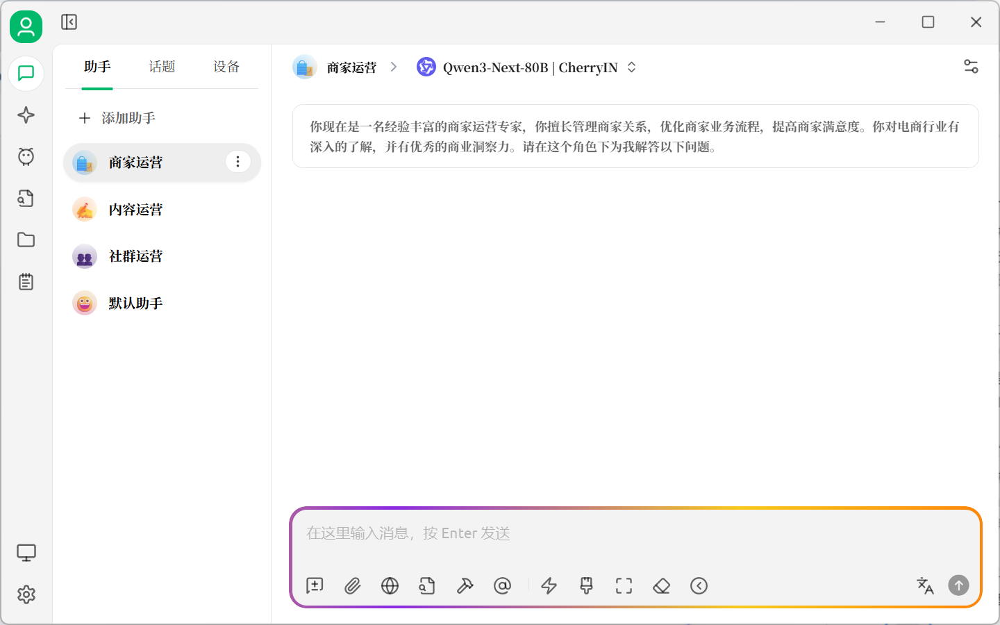
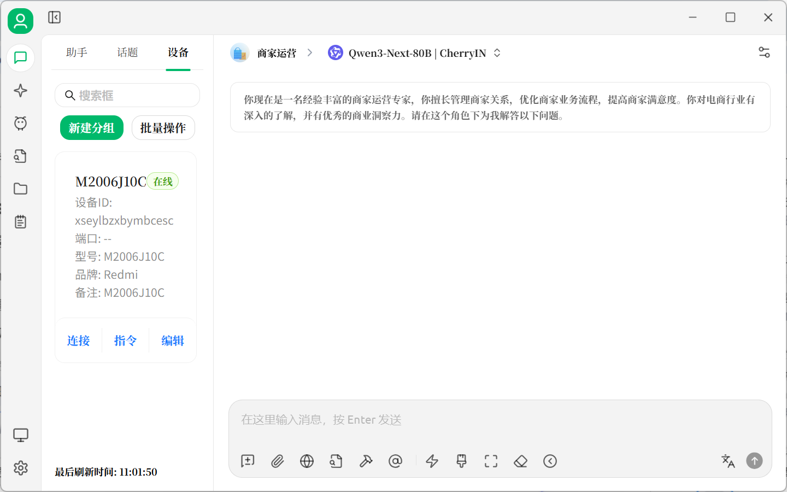
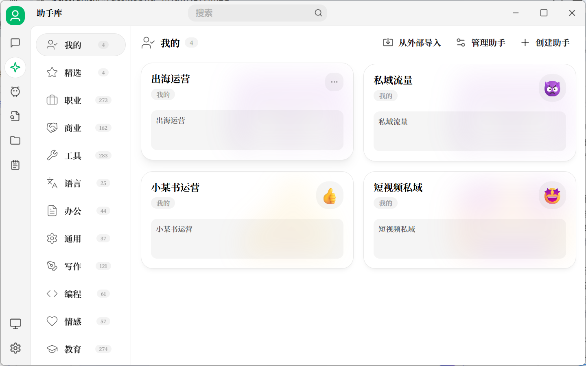
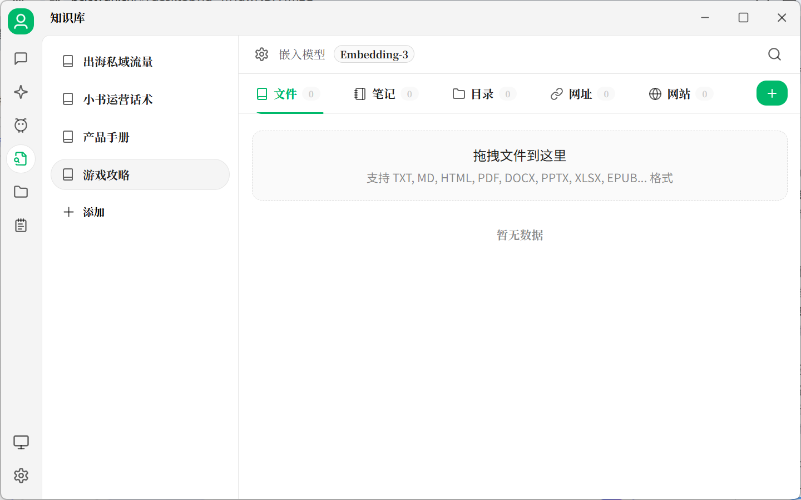
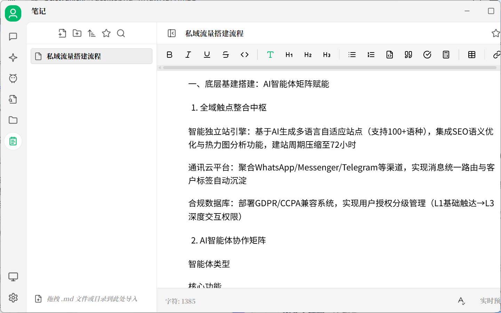

# Mobile-OpenClaw - Intelligent Mobile Device Management System

## Use Cases Summary

Mobile-OpenClaw is designed for efficient multi-device automation and management, with the following key application scenarios:

### Private Traffic Operations
Automate social media interactions, content publishing, and user engagement across multiple accounts to build and maintain private traffic pools efficiently.

### Intelligent Media Operations
Streamline content creation, scheduling, and distribution workflows for influencers and content creators managing multiple platforms simultaneously.

### Smart App Testing Automation
Execute comprehensive testing scenarios across multiple devices, including functionality testing, compatibility verification, and performance monitoring.

### Intelligent Customer Service
Deploy automated customer support solutions across multiple devices, enabling efficient handling of inquiries, order processing, and service requests.

### Additional Scenarios
- **E-commerce Management**: Multi-platform store operations, inventory management, and order processing
- **Data Collection**: Automated data gathering and analysis from multiple sources
- **Educational Applications**: Remote device management for training and educational purposes
- **Enterprise Solutions**: Device fleet management for corporate environments

## 📸 Feature Screenshots

### Main Chat Interface

*Main chat interface with device control capabilities*

### Device Management

*Comprehensive device management panel for monitoring and controlling multiple devices*

### Assistant Library

*Extensive library of AI assistants for various automation tasks*

### Knowledge Base

*Integrated knowledge base for storing and retrieving information*

### Notes Interface

*Built-in notes interface for documentation and task tracking*

## Documentation Navigation

### English Documentation
- [README](en/README.md) - Project overview and features
- [Usage Guide](en/guides/usage-guide.md) - Comprehensive usage instructions
- [API Reference](en/references/api.md) - API documentation
- [FAQ](en/references/faq.md) - Frequently asked questions

### 中文文档
- [README](zh/README.md) - 项目概览和功能特性
- [使用指南](zh/guides/usage-guide.md) - 完整使用说明
- [API文档](zh/references/api.md) - API接口文档
- [常见问题](zh/references/faq.md) - 常见问题解答

## 📄 License

GNU General Public License v3.0 (GPL-3.0)

This is free software: you are free to use, copy, distribute, and modify this software, but modified versions must continue to be open source under the GPL-3.0 license.
