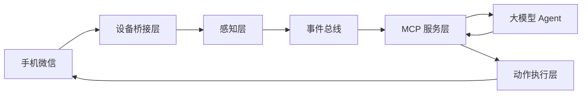

# 微信聊天监听与回复 MCP Service 技术方案（合规版）

## 0. 合规声明（必须）
本方案仅用于合法、授权、可审计的场景（如个人效率助手、无障碍辅助、企业客服辅助），并且必须满足：

1. 设备与账号为本人或已获得明确授权。
2. 所有语音通话参与方均已知情并同意。
3. 不进行隐蔽监听、破解、绕过安全机制、加密流量解密。
4. 具备可关闭、可审计、可追责能力。

---

## 1. 需求目标

构建一个可供大模型调用的 MCP Service，实现：

1. 电脑侧实时感知手机微信内容：
   - 文字消息
   - 语音消息（播放后转写）
   - 语音通话内容（仅外放与麦克风可采集音频）
2. 向大模型提供标准化 MCP tools。
3. 支持两种回复通道：
   - 手机输入框文字发送
   - 声卡/TTS 语音实时回复（按住说话发送或电脑播报）

---

## 2. 总体架构

### 2.1 模块职责
- 设备桥接层：设备连接、屏幕采集、UI 控制、状态读取。
- 感知层：OCR/ASR/VAD/VLM，提取可结构化事件。
- 事件总线：统一消息协议与去重缓存。
- MCP 服务层：将能力暴露为 tools/resources/events。
- 动作执行层：发文字、发语音、切会话、通话辅助动作。

---

## 3. 技术选型（开源优先）

## 3.1 手机控制与桥接
- ADB：设备连接、输入、截图、点击。
- scrcpy：低延迟投屏与调试。
- uiautomator2 或 Appium：UI 自动化与控件定位。
- 建议优先 Android（iOS 自动化与音频链路限制更多）。

## 3.2 文本识别
- 首选：Accessibility/UI 树提取（高精度、低延迟）。
- 兜底：PaddleOCR（中文强）/Tesseract。

## 3.3 语音识别
- ASR：faster-whisper。
- 语音活动检测：webrtcvad 或 silero-vad。
- 可选：pyannote（说话人分离，用于通话场景）。

## 3.4 语音合成
- edge-tts / Piper / Coqui TTS。

## 3.5 音频采集链路（Windows）
- WASAPI loopback：采集系统播放音频。
- 虚拟声卡（如 VB-CABLE）：路由 TTS/系统音频。
- 麦克风输入 + 系统输出混合，送入 ASR 实时流。

## 3.6 MCP 服务框架
- Node.js + TypeScript + MCP SDK。
- 事件推送建议：SSE 或 WebSocket。

---

## 4. MCP 能力接口设计

## 4.1 Tools（最小可用集）
1. `wechat_get_recent_events(limit, since)`
2. `wechat_open_chat(target)`
3. `wechat_send_text(target, content)`
4. `wechat_send_voice(target, tts_text, voice_profile)`
5. `wechat_start_call_assist(mode)`
6. `wechat_stop_call_assist()`
7. `device_get_state()`
8. `agent_pause()`
9. `agent_resume()`

## 4.2 统一事件结构
- `event_id`
- `timestamp`
- `chat_id`
- `sender`
- `type`：`text | voice | call_transcript | system`
- `content`
- `confidence`
- `source`：`ui | ocr | asr | vlm`

---

## 5. 关键流程设计

## 5.1 文字消息监听
优先级策略：

1. 通知/Accessibility 捕获新消息。
2. UI 树读取会话页面消息节点。
3. OCR 识别作为兜底。
4. 事件去重后推送 MCP。

## 5.2 语音消息转写
1. 自动点击语音消息播放。
2. 电脑端采集系统音频。
3. VAD 分段后送 Whisper。
4. 分段拼接、打标说话人（可选）、生成事件。

## 5.3 语音通话辅助
1. 启动外放与采集链路。
2. 实时 ASR 输出转写片段。
3. 大模型生成建议回复。
4. 根据策略“人工确认/自动播报”。

> 说明：不涉及通话底层流量抓取、加密流解密或协议逆向。

## 5.4 实时回复执行
- 文字：写入输入框并发送（支持发送前确认）。
- 语音：LLM 文本 → TTS 音频 → 按住说话发送或电脑播报。

---

## 6. 风险控制与治理（必须）

1. 首次启用强制弹窗：用途声明 + 同意确认。
2. 默认人工确认发送，自动发送需显式开启。
3. 敏感词/高风险内容二次确认。
4. 全链路审计日志：触发源、tool 参数、执行结果。
5. 凭据与配置本地加密存储，可一键清空。
6. 自动化节流：随机抖动、频率上限、失败回退。
7. 急停机制：`agent_pause()` 随时停用自动动作。

---

## 7. 分阶段落地计划

## Phase 1（1-2 周）
- MCP 基础框架
- 文字消息监听
- 文字自动回复（默认确认模式）

## Phase 2（1-2 周）
- 语音消息播放与转写
- TTS 语音回复链路

## Phase 3（2 周）
- 通话辅助实时转写
- 延迟与稳定性优化

## Phase 4（持续）
- 多机型兼容
- 风控策略迭代
- 观测与报警完善

---

## 8. MVP 验收标准（建议）

1. 文字消息端到端（监听→LLM→回复）成功率 > 95%。
2. 语音消息转写平均延迟 < 2.5s（短语音）。
3. 通话辅助字幕延迟 < 1.5s（分段输出）。
4. 自动动作可随时急停，日志完整可追溯。
5. 连续运行 2 小时无严重异常。

---

## 9. 不在本方案范围

1. 隐蔽监听、未经授权采集。
2. 协议逆向破解、加密流解密。
3. 绕过平台安全机制与反作弊策略。
4. 任何违反法律法规与平台条款的用途。
